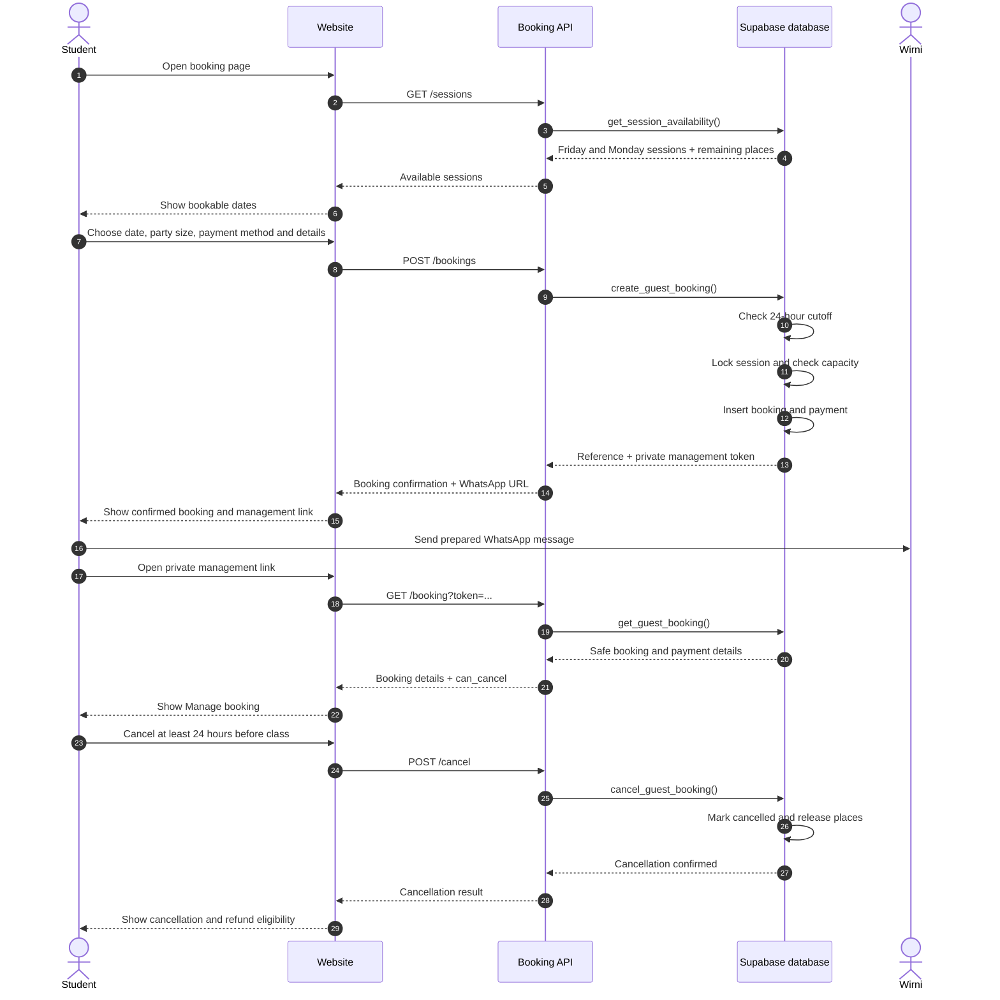
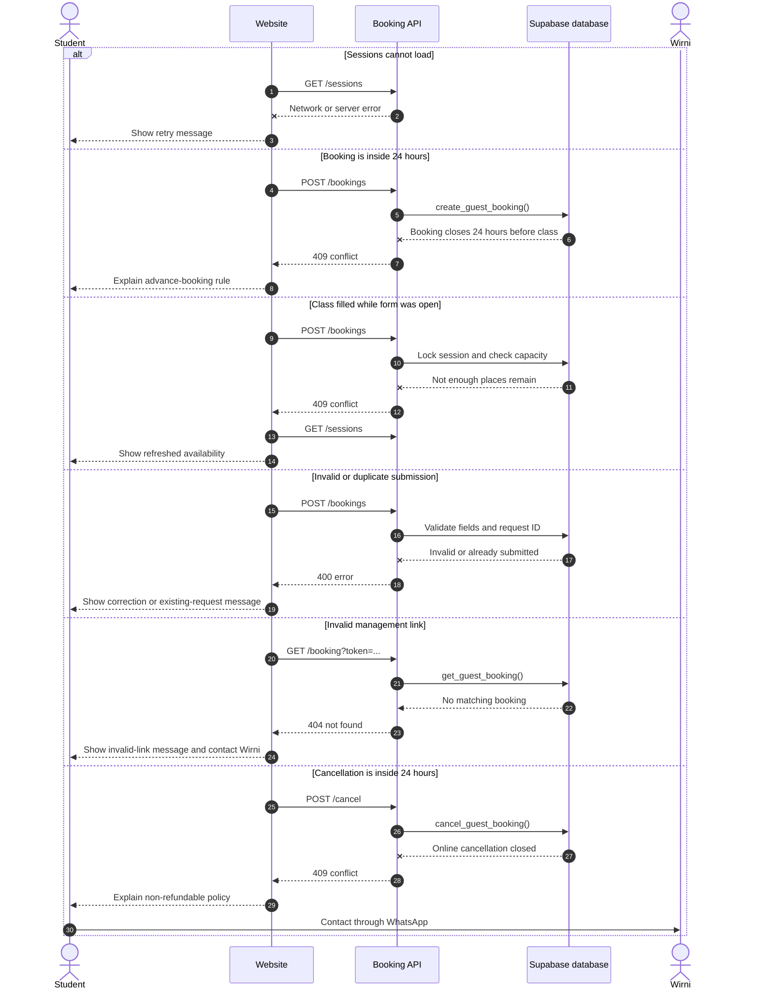

# Booking flow — one-page reference

## System boundary

```text
Customer → Mama Ashtanga website → Booking API → Supabase database
                                      ↓
                               WhatsApp to Wirni
```

Development API base URL:

```text
https://nvkbobgmrxkjttjvxddl.supabase.co/functions/v1/booking-api
```

## Happy path



## Unhappy paths



## API responsibility map

| Request | Database function | Result |
|---|---|---|
| `GET /sessions` | `get_session_availability` | Public dates, prices, and remaining places |
| `POST /bookings` | `create_guest_booking` | Capacity-safe booking, payment record, reference, and management token |
| `GET /booking?token=...` | `get_guest_booking` | One booking's safe management details |
| `POST /cancel` | `cancel_guest_booking` | Cancellation when eligible and immediate capacity release |

## Schedule and rules

| Class | Schedule | Capacity | Price | Booking rule |
|---|---|---:|---:|---|
| Group Yoga | Friday, 6:00–7:00 PM | 6 | RM30/person | Book at least 24 hours ahead |
| Private Yoga | Monday, preferred time requested | 2 | To be decided | Book at least 24 hours ahead |

Customer cancellation is refundable at least 24 hours before class. Inside 24 hours, online cancellation is closed and the booking is non-refundable. If Wirni cancels a class, paid customers are eligible for a full refund.

## Environment status

| Environment | Current state | Purpose |
|---|---|---|
| Local static website | Available | View the existing frontend with `python3 -m http.server 8000` |
| Hosted Supabase development project | Available | Database and deployed Booking API testing |
| Local Supabase stack | Not available | Requires Docker or another container runtime |
| Separate staging website/database | Not created | Safe end-to-end testing before production |
| Production website/backend | Not configured as a separate environment | Public release after staging passes |

The current Supabase project is treated as **development**. It contains test data and should not be used as production until a separate production project and deployment process exist.

