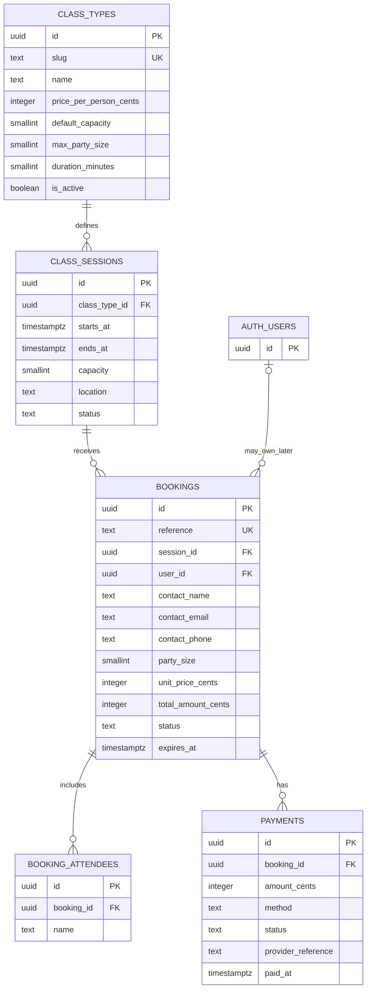
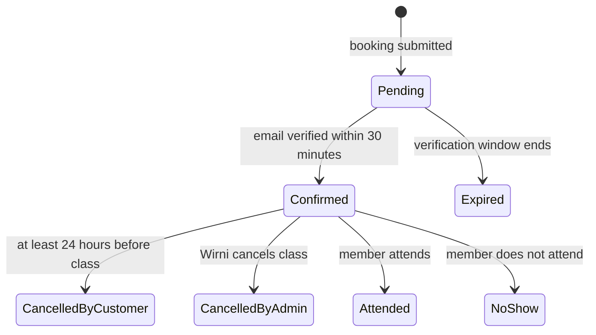
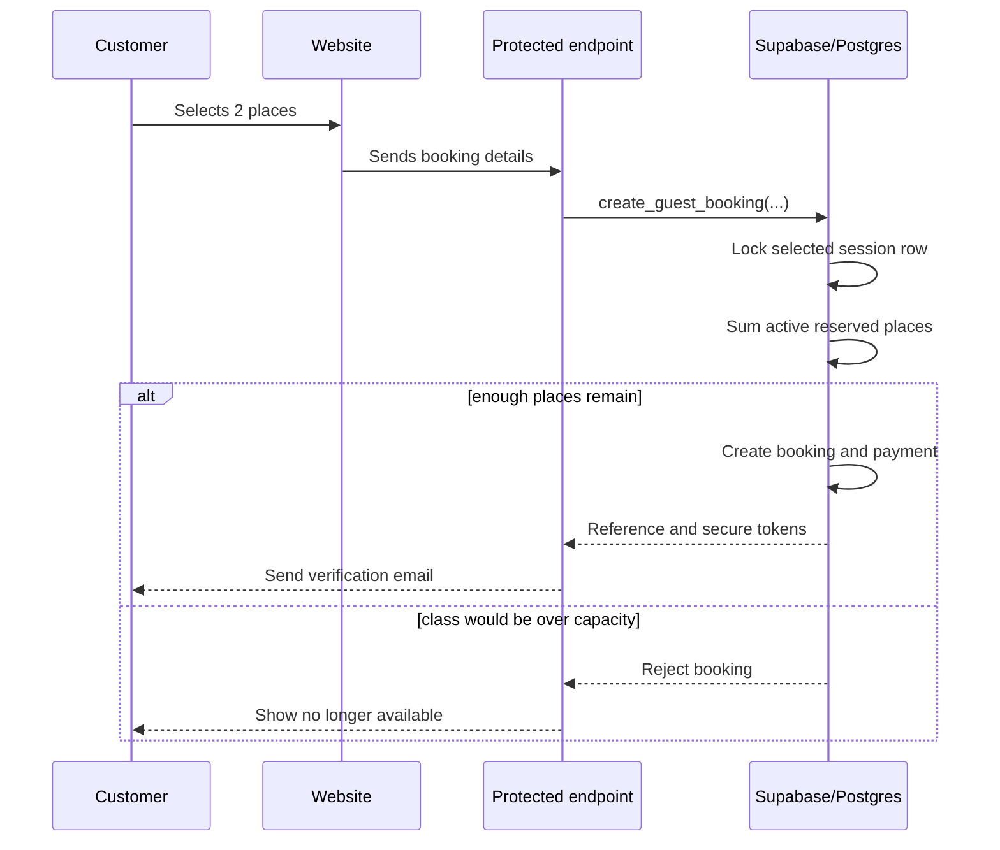
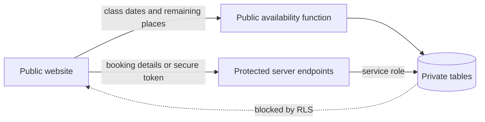

# Mama Ashtanga database guide

This guide explains the Supabase backend in `supabase/migrations`. The initial migration creates the model; later migrations evolve its booking rules and API functions.

The migration is code that describes the database. It has not been applied to a live Supabase project yet, so there is no live data or dashboard to inspect yet.

## Database map



`PK` means primary key: the unique identity of one row. `FK` means foreign key: a reference to a row in another table. `UK` means unique key: duplicates are rejected.

## Why the data is separated

### Class type versus class session

A **class type** is the reusable business definition. “Group Yoga” costs RM40 per person, normally holds six people, and allows a maximum of three people in one booking.

A **class session** is one occurrence on the calendar, such as Group Yoga on Friday, 18 September 2026 at 6:00 PM. Its capacity is copied from the class type but can be changed for that specific date.

This separation means changing one cancelled Friday does not change every Friday class.

```text
Group Yoga definition
├── Friday 18 Sep, 6 PM
├── Friday 25 Sep, 6 PM
└── Friday 2 Oct, 6 PM
```

### Booking versus attendee

A booking belongs to the person making the reservation. `party_size` says how many places it consumes. If Gracia books for herself and Maya, there is one booking with a party size of two and one optional attendee row for Maya.

This avoids forcing every friend in a group booking to create an account or repeat contact details.

### Booking versus payment

A booking answers “who is attending which class?” A payment answers “how much was paid, how, and what is its status?”

They change independently. A confirmed booking can still be unpaid, and a cancelled paid booking can be waiting for a refund. Keeping separate payment rows preserves that history.

Money is stored as integer sen. RM40 is stored as `4000`. Integer arithmetic avoids floating-point rounding errors.

## Booking lifecycle



Pending bookings reserve places for 30 minutes. This prevents another person taking the places while the customer verifies their email. Expired holds stop counting toward capacity automatically.

## Capacity protection

The browser displays availability, but the database makes the final decision.



Locking the session makes simultaneous bookings wait their turn. For a six-person class with five places already reserved, two customers cannot both take the last place.

Availability uses this rule:

```text
remaining places = session capacity
                 - confirmed party sizes
                 - unexpired pending party sizes
```

## Cancellation protection

The database stores a hash of the cancellation token, not the usable token itself. The customer receives the original token in a secure email link.

When the link is used, the backend hashes the submitted token and looks for the matching booking. The database allows cancellation only when:

- the token matches;
- the booking is confirmed; and
- the request arrives at least 24 hours before the session starts.

After cancellation, the booking record stays in the database with a cancelled status. Its places immediately become available again.

## Public and private boundaries



The browser may call `get_session_availability`. It returns class name, time, location, price, capacity, and remaining places. It never returns customer names, email addresses, phone numbers, notes, tokens, or payments.

The browser cannot directly call booking, confirmation, or cancellation database functions. Protected server endpoints will call those functions with the Supabase service role. The service-role key must stay on the server.

Row Level Security is enabled on every table. Table access is removed from anonymous and ordinary authenticated browser clients. This gives two layers of protection: database permissions and the protected endpoints.

## Files and their jobs

| File | Purpose |
|---|---|
| `supabase/config.toml` | Local Supabase ports and authentication defaults |
| `supabase/migrations/` | Versioned tables, validation rules, indexes, functions, permissions, and security |
| `supabase/functions/booking-api/` | Public HTTP routes that safely call protected database functions |
| `supabase/seed.sql` | Initial Group Yoga and Private Yoga definitions |
| `supabase/tests/database/booking_rules.test.sql` | Automated checks for tables, prices, capacities, and function permissions |

The migration is the source of truth. Making the same database change by hand in the Supabase dashboard would be hard to review and reproduce. A new change should normally be added as another migration file.

## Current defaults

| Rule | Current value |
|---|---:|
| Group price per person | RM40 |
| Group session capacity | 6 |
| Maximum group party size | 3 |
| Private session capacity | 2 |
| Private price | Not decided |
| Pending email-verification hold | 30 minutes |
| Refundable cancellation cutoff | 24 hours before class |

## What happens next

1. Create a Supabase development project.
2. Apply the migration and seed data.
3. Run the database tests.
4. Add protected endpoints for booking, email verification, and cancellation.
5. Connect the website calendar to public availability.
6. Add the booking form fields for email, party size, and payment method.
